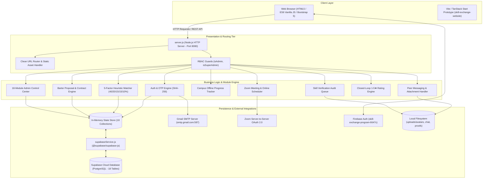

# Student Skill Exchange Platform — Master Architecture Document

---

## 1. Project Overview

The **Student Skill Exchange Platform** is a peer-to-peer web platform designed for collegiate environments (specifically configured for **MGM College of Engineering & Technology**, Mumbai). It enables university students to exchange academic, programming, creative, and professional skills on a pure **barter basis** without financial transactions. 

A student proficient in Java can teach core OOP and Spring Boot to a peer in direct reciprocity for learning Adobe Photoshop, Python data analysis, or Public Speaking.

### Core Value Propositions
1. **Financial Friction Elimination**: Substitutes paid private tutoring with double coincidence of wants skill barter.
2. **Explainable 5-Factor Heuristic Matching**: Ranks potential exchange partners deterministically using direct skill compatibility, reverse barter synergy, peer ratings, admin verification status, and academic department synergy.
3. **Multi-Modal Learning Delivery**: Supports three distinct delivery workflows: **Online** (with automated Zoom meeting scheduling), **Offline** (with campus meeting logs, locations, and milestone progress percentages), and **In-Built Chat** (peer messaging with media attachments).
4. **Administrative Verification Pipeline**: Document and portfolio verification queue where staff auditors evaluate certificates, GitHub repositories, and student work to award official **✓ VERIFIED SKILL** badges.
5. **Closed-Loop Accountability**: Single-submission 1–5 star peer reviews that recalculate trust scores dynamically upon trade completion.
6. **Campus Resource Expansion (Kitab Bhandar)**: Physical textbook and handwritten study notes barter marketplace.

---

## 2. Technology Stack

The project exhibits a **dual-backend architecture** resulting from an academic Java Spring Boot implementation paired with a lightweight, high-performance Node.js runtime server and native Supabase cloud database integration.

### Frontend
- **Markup & Layout**: HTML5 (17 standalone multi-page static views), Bootstrap 5.3.3 responsive grid, Bootstrap Icons (`bi-*`).
- **Styling Architecture**: Custom Neo-Brutalist CSS design system (`src/main/resources/static/css/style.css`, 97 KB) featuring high-contrast solid borders (`2px solid #18181b`), unblurred tactile drop shadows (`3px 3px 0px #18181b`), curated HSL color tokens, and Google Fonts (`Space Grotesk`, `Inter`, `JetBrains Mono`).
- **Dynamic Backgrounds & Motifs**: `src/main/resources/static/js/decorations.js` rendering low-opacity SVG educational and architectural motifs (knowledge nodes, graduation caps, code brackets, barter loops).
- **Client-Side Controllers**: Native ES6 JavaScript (`src/main/resources/static/js/app.js`) utilizing asynchronous `fetch()` HTTP requests to communicate with REST APIs.
- **Authentication Client**: Firebase Authentication JavaScript SDK v10.12.0 (`src/main/resources/static/js/firebase-auth.js`) supporting 1-Click Google Sign-In popups.
- **Secondary Frontend Prototype**: Vite 8 + TanStack Start + React 19 + Tailwind CSS 4 scaffold located in `skill-exchange-website/` (scaffolded from Lovable for modern landing page exploration).

### Backend
- **Active Runtime Server**: Node.js (`server.js`, 5,393 lines) utilizing native `http`, `fs`, `path`, `crypto`, and `url` modules.
  - Zero third-party web frameworks (no Express); implements manual URL routing, request body parsing, multipart handling, and CORS headers.
  - Port: `8080` (or `process.env.PORT`).
  - Dual State Engine: In-memory JavaScript data store (`state`) with asynchronous cloud persistence to Supabase via `@supabase/supabase-js`.
- **Alternative / Academic Backend**: Java 17 + Spring Boot 3.2.5 (`pom.xml`, `src/main/java/com/skillexchange/`).
  - Web: Spring MVC (`@RestController`, `@Controller`).
  - Security: Spring Security 6 (`SecurityFilterChain`, `BCryptPasswordEncoder`, Role-based access control with `ROLE_STUDENT`, `ROLE_ADMIN`, `ROLE_SUPER_ADMIN`).
  - Persistence: Spring Data JPA / Hibernate ORM.
  - Validation: Hibernate Validator (`jakarta.validation`).
  - Email: Spring Boot Starter Mail (JavaMailSender via Gmail SMTP).

### Database & Persistence
- **Cloud Database**: **Supabase PostgreSQL** (`https://qfokonidfrpkunkuivwo.supabase.co`).
  - 18 Relational tables defined in `supabase_schema.sql`.
  - Row Level Security (RLS) enabled across all tables with open policies for server-side key access.
- **Relational Database (Java Spring Boot)**: **MySQL 8.0+** (`skill_exchange_db` defined in `DATABASE_SETUP.sql`).
  - Fallback profile: In-memory **H2 Database** for zero-dependency standalone execution.
- **In-Memory Cache (Node.js)**: 18 collections in `server.js:state` keeping active sessions, real-time message queues, Zoom records, offline milestones, and audit trails.

### External Integrations
- **Email Service**: Gmail SMTP (`smtp.gmail.com:587` with STARTTLS) via `nodemailer` (Node) and `JavaMailSender` (Spring Boot).
- **Video Conferencing**: Zoom Server-to-Server OAuth 2.0 API (`zoom.us/v2/users/me/meetings`) with dynamic meeting link generation.
- **Cloud Authentication**: Firebase Authentication (`skill-exchange-program-6647c`).
- **File System Storage**: Local directory storage in `src/main/resources/static/uploads/` (`avatars`, `certificates`, `chat`, `proofs`, `verifications`).

---

## 3. Project Structure

```
Skill-Exchange/
├── .env                                  # Active environment credentials (SMTP, Supabase, Zoom, Admin)
├── .env.example                          # Template for environment configuration
├── DATABASE_SETUP.sql                    # MySQL 8 relational schema DDL and initial seed queries
├── PROJECT_DOCUMENTATION.md              # Academic mini-project report with architecture & ER diagrams
├── README.md                             # Quickstart guide and demo login credentials
├── SUPABASE_INTEGRATION_GUIDE.md         # Guide for running schema and activating Supabase cloud sync
├── package.json                          # Node.js dependencies (@supabase/supabase-js, firebase, nodemailer)
├── pom.xml                               # Java Maven project configuration (Spring Boot 3.2.5)
├── server.js                             # Active runtime Node.js HTTP server & REST API router (5,393 lines)
├── supabaseService.js                    # Supabase JavaScript client, table sync & async cloud writers
├── supabase_schema.sql                   # Supabase PostgreSQL schema with 18 tables & RLS policies
│
├── skill-exchange-website/               # Modern React 19 / TanStack Start prototype scaffold
│   ├── package.json                      # React 19, TanStack Start, Tailwind CSS 4, Radix UI
│   ├── vite.config.ts                    # Vite build configuration
│   └── src/                              # Prototype React routes and components
│
└── src/main/
    ├── java/com/skillexchange/           # Complete Java Spring Boot enterprise architecture
    │   ├── SkillExchangeApplication.java # Spring Boot entry point
    │   ├── config/DataInitializer.java   # Startup database seeder
    │   ├── controller/                   # 15 REST and WebPage Spring controllers
    │   ├── dto/                          # Data transfer objects (Requests/Responses)
    │   ├── entity/                       # 19 JPA relational entities
    │   ├── exception/                    # Global @RestControllerAdvice exception handler
    │   ├── repository/                   # Spring Data JPA repositories
    │   ├── security/                     # Spring Security 6 & BCrypt configuration
    │   └── service/                      # 17 Business logic services
    │
    └── resources/
        ├── application.properties        # Spring Boot config (MySQL, H2, Mail, Zoom, Uploads)
        ├── static/                       # Active Web Application Frontend
        │   ├── css/style.css             # Neo-Brutalist design system (97 KB)
        │   ├── js/app.js                 # Frontend API client, auth checker, notifications
        │   ├── js/decorations.js         # Educational SVG decorative patterns
        │   ├── js/firebase-auth.js       # Firebase 1-Click Google sign-in
        │   ├── uploads/                  # Uploaded files (avatars, certificates, chat, proofs)
        │   └── *.html                    # 17 Application HTML views
        └── templates/                    # Thymeleaf mirror of HTML views
```

---

## 4. Pages & Routes

The application serves 17 HTML pages with clean URL rewrite support in `server.js`:

| Page | URL / Route | Access | Purpose |
| :--- | :--- | :--- | :--- |
| **Landing** | `/landing`, `/landing.html` | Public | First-time visitor presentation, value proposition, free trial CTA |
| **Home / Feed** | `/`, `/home`, `/index.html` | Public / Hybrid | Public skill directory, categories, platform stats |
| **Login** | `/login`, `/login.html` | Public | Credential login, 1-click demo buttons, Google sign-in |
| **Register** | `/register`, `/register.html` | Public | Account registration enforcing `@mgmmumbai.ac.in` domain |
| **Email Verification** | `/verify`, `/verify-email.html` | Public | 6-digit cryptographic OTP entry with 10-minute timer |
| **Forgot Password** | `/forgot-password.html` | Public | Password recovery via 6-digit email OTP |
| **Dashboard** | `/dashboard`, `/dashboard.html` | Protected | Student summary KPIs, active trades, upcoming sessions |
| **Profile** | `/profile`, `/profile.html` | Protected | Bio, avatar upload, portfolio projects, experience timeline |
| **Skills** | `/skills`, `/skills.html` | Protected | Repertoire of skills taught (with proof) and skills desired |
| **Find Matches** | `/matches`, `/matches.html` | Protected | 5-Factor Heuristic Matcher with compatibility scores |
| **Exchange Proposals** | `/requests`, `/exchange-proposals` | Protected | Management of barter proposals (Received & Sent) |
| **Chat & Sessions** | `/chat`, `/chat.html` | Protected | Direct peer messaging, Zoom meeting launcher, notes/doubts |
| **Skill Verification** | `/verification`, `/verification.html` | Protected | Student proof submission (certificates, project links) |
| **Exchange History** | `/history`, `/exchange-history.html` | Protected | Historical trade ledger and 1-5 star peer reviews |
| **Notifications** | `/notifications`, `/notifications.html` | Protected | Notification center and event feed |
| **Admin Dashboard** | `/admin`, `/admin/*` | Protected (`ROLE_ADMIN`, `ROLE_SUPER_ADMIN`) | 18-tab centralized administrative management panel |
| **Links / Sitemap** | `/links`, `/links.html` | Public | Developer & presentation directory indexing all screens |

---

## 5. Features

### 1. Collegiate Domain Enforcement & OTP Verification
- Students must register with an `@mgmmumbai.ac.in` email address.
- Registration dispatches a cryptographically secure 6-digit OTP (generated via `crypto.randomInt(100000, 1000000)`).
- OTPs expire after 10 minutes; stored in `state.otps` as SHA-256 hashes (`crypto.createHash('sha256')`).

### 2. Multi-Method Authentication
- Standard credential login with email and password verified against stored user records.
- 1-Click demonstration buttons for immediate evaluator testing (Harsh, Sejal, Raza, Udipti, Admin, Super Admin).
- Firebase Google Sign-In (`firebase-auth.js`) automatically synchronizing student Google accounts into the platform backend.

### 3. Explainable 5-Factor Skill Matchmaking
Deterministic compatibility scoring between Requester (Student A) and Candidate (Student B):
$$\text{Match Score} = S_{\text{direct}} (40\%) + S_{\text{reverse}} (20\%) + S_{\text{rating}} (15\%) + S_{\text{verification}} (15\%) + S_{\text{synergy}} (10\%)$$
- **Direct Skill (40%)**: Candidate teaches $\ge 1$ skill that Requester wants.
- **Reverse Mutual Trade (20%)**: Requester teaches $\ge 1$ skill that Candidate wants (true bilateral barter).
- **Peer Rating (15%)**: Proportional score based on student's average star rating: `(rating / 5.0) * 15`. Defaults to 3.5 stars (10.5 pts) for newcomers.
- **Verification Status (15%)**: +15 points for candidates holding an approved **✓ VERIFIED SKILL** badge (+6 pts for unverified standard profiles).
- **Academic Synergy (10%)**: +10 pts for identical Department & College; +7 pts for same College; +4 pts for cross-campus trades.

### 4. Bilateral Barter Proposals & Contracts
- Student A initiates a proposal selecting one of their teaching skills and one of Candidate B's skills, choosing a delivery mode (Online, Offline, Chat).
- Candidate B receives real-time notification; can **Accept** or **Reject**.
- On Acceptance, the proposal spawns a binding barter contract in `state.exchanges`, initiates a Chat thread, creates an Online Session record, and logs an Offline Progress card.
- Either participant can trigger **Mark Completed**, which prompts both students to leave a post-trade review.

### 5. Multi-Modal Learning Workflows
- **Online (Zoom)**: Server-to-Server OAuth 2.0 integration generates official Zoom meeting IDs, join URLs, and passcodes. Live status updates dynamically when scheduled time arrives.
- **Offline (Campus)**: Milestone tracking with percentage completion bars (0% → 25% → 60% → 100%), meeting locations (e.g. "Library Room 204"), curriculum logs, and overdue tracking.
- **In-Built Chat**: Real-time peer-to-peer messaging with media file attachments, read receipts (`SENT`, `DELIVERED`, `SEEN`), reply quoting, and shared study notes.

### 6. Administrative Verification & Audit Pipeline
- Students submit verification proof: Certificate PDFs, GitHub repositories, Behance portfolios, and teaching experience.
- Administrators review submissions in `/admin/verification` with three possible outcomes:
  - **Approve**: Awards the verified badge, toggles `is_verified = true`, and grants +15% matching boost.
  - **Reject**: Rejects with administrative justification comment.
  - **Request Resubmission**: Requests additional proof or live repository links without outright rejection.

### 7. Closed-Loop Peer Review & Rating System
- Enforces a strict database constraint: `UNIQUE (exchange_id, reviewer_id)`.
- Students can only submit a review after an exchange is marked **COMPLETED**.
- Submitting a review recalculates the student's dynamic `average_rating` and increments `completed_exchanges_count`.

### 8. Kitab Bhandar (Campus Book & Notes Barter)
- Barter marketplace allowing students to list physical textbooks and course notes.
- Each listing includes title, author, course category, condition (e.g. "Mint Condition"), owner contact, and desired barter book.
- Administrative oversight allows filtering by status (`AVAILABLE`, `EXCHANGED`), toggling availability, or removing inappropriate items.

### 9. 30-Day Free Trial & Membership System
- Tracks student membership tiers: **30-Day Free Trial**, **Pro Scholar (Monthly)**, and **Pro Scholar (Annual)**.
- Real-time countdown calculation displays remaining trial days (e.g. 21 days remaining) on profile and dashboard.
- Admin panel includes a dedicated **Memberships / Subscriptions** pane to grant trial extensions or toggle premium status.

---

## 6. User Roles & Permissions

| Capability | `ROLE_STUDENT` | `ROLE_ADMIN` | `ROLE_SUPER_ADMIN` |
| :--- | :---: | :---: | :---: |
| Access Public Pages & Skill Catalogue | Yes | Yes | Yes |
| Manage Personal Profile, Bio & Skills | Yes | Yes | Yes |
| Propose, Accept, Complete Skill Barters | Yes | Yes | Yes |
| Peer Chat, Upload Attachments & Notes | Yes | Yes | Yes |
| Submit Skill Verification Proof | Yes | No (Staff) | No (Staff) |
| Access Admin Dashboard (`/admin/*`) | **No (403)** | Yes | Yes |
| View Platform Statistics & Analytics | No | Yes | Yes |
| Audit & Approve Skill Proof Documents | No | Yes | Yes |
| Moderate Reviews & Inappropriate Books | No | Yes | Yes |
| Suspend or Activate Student Accounts | No | Yes | Yes |
| Broadcast Campus-Wide Announcements | No | Yes | Yes |
| Promote Student to `ROLE_ADMIN` | **No** | **No (403 Forbidden)** | **Yes** |
| Demote Admin to `ROLE_STUDENT` | **No** | **No (403 Forbidden)** | **Yes** |
| Create New Administrative Staff Accounts | **No** | **No (403 Forbidden)** | **Yes** |
| Modify Platform Governance Settings | **No** | Yes | Yes |

### Designated Super Admin Identity
- Configured in `server.js:L71`: `harshtukaram45@gmail.com` and `process.env.SUPER_ADMIN_EMAIL`.
- Immune to deactivation, status suspension, or role demotion.

---

## 7. Authentication Flow

```
[Student Registration]
  │
  ├── 1. POST /api/auth/register (fullName, email, password, department, year)
  │      └── Validates email syntax & @mgmmumbai.ac.in college domain.
  ├── 2. Generates 6-digit cryptographic OTP (randomInt 100000..999999).
  │      └── Stores SHA-256 hash in state.otps (10 min expiry).
  ├── 3. Sends HTML email via Gmail SMTP (smtp.gmail.com:587 STARTTLS).
  │      └── Redirects student to verify-email.html.
  └── 4. POST /api/auth/verify-email (email, otp)
         ├── Verifies SHA-256(otp) matches stored hash.
         ├── Activates user (active=true, emailVerified=true).
         └── Establishes authenticated session cookie & redirects to dashboard.html.

[Student / Admin Login]
  │
  ├── 1. POST /api/auth/login (email, password)
  │      ├── Validates credentials against state.users (or BCrypt in Spring Boot).
  │      ├── Sets state.currentUser session object.
  │      └── Returns JSON session envelope with user roles and profile details.
  │
  └── 2. Google Firebase 1-Click Login (POST /api/auth/firebase-login)
         ├── Client authenticates with Google via Firebase Auth popup.
         ├── Sends user payload to backend.
         └── Backend synchronizes or creates user & student_profile, then establishes session.

[Route Protection]
  │
  ├── Client-side (app.js): Unauthenticated users navigating to protected pages are redirected to landing.html (new visitors) or login.html (returning).
  └── Server-side (server.js): Requests to /admin* without isAdmin(currentUser) receive an HTTP 302 redirect to /login.html?unauthorized=admin_required.
```

---

## 8. Supabase Deep Analysis

- **Target Project URL**: `https://qfokonidfrpkunkuivwo.supabase.co`
- **Integration Layer**: `supabaseService.js` using `@supabase/supabase-js`.
- **Startup Synchronization (`syncFromSupabase`)**: When `SUPABASE_KEY` is present in `.env`, the server queries all 18 tables on startup and populates the in-memory `state` collections.
- **Asynchronous Cloud Persistence**: Every mutation endpoint triggers background sync functions (`saveUser`, `saveProfile`, `saveTeachingSkill`, `saveExchangeRequest`, `saveExchange`, `saveMessage`, `saveVerification`, `saveReview`, `saveAuditLog`, etc.).
- **Row Level Security**: Enabled across all tables. Defined in `supabase_schema.sql` with a universal access policy (`FOR ALL USING (true) WITH CHECK (true)`).
- **Supabase Storage**: Not currently configured via Supabase Storage buckets. File storage currently defaults to local directory storage (`src/main/resources/static/uploads/`).
- **Edge Functions**: None implemented.
- **Realtime Subscriptions**: Not currently connected on frontend client; frontend utilizes client-side polling (`setInterval` in `app.js` and `chat.html`).

---

## 9. Database Deep Analysis

### Table Schema Summary

| Table | Primary Key | Foreign Keys | Key Constraints | RLS Policy |
| :--- | :--- | :--- | :--- | :--- |
| `users` | `id` (BIGINT) | None | `email` UNIQUE | Enabled (Open policy) |
| `student_profiles` | `id` (BIGINT) | `user_id` → `users(id)` | `user_id` UNIQUE | Enabled (Open policy) |
| `skill_categories` | `id` (BIGINT) | None | `name` UNIQUE | Enabled (Open policy) |
| `skills` | `id` (BIGINT) | `category_id` → `skill_categories(id)` | `name` UNIQUE | Enabled (Open policy) |
| `user_teaching_skills` | `id` (BIGINT) | `user_id`, `skill_id` | `UNIQUE(user_id, skill_id)` | Enabled (Open policy) |
| `user_learning_skills` | `id` (BIGINT) | `user_id`, `skill_id` | `UNIQUE(user_id, skill_id)` | Enabled (Open policy) |
| `projects` | `id` (BIGINT) | `student_id` → `users(id)` | None | Enabled (Open policy) |
| `experiences` | `id` (BIGINT) | `student_id` → `users(id)` | None | Enabled (Open policy) |
| `exchange_requests` | `id` (BIGINT) | `sender_id`, `receiver_id`, `skill_offered_id`, `skill_requested_id` | None | Enabled (Open policy) |
| `exchanges` | `id` (BIGINT) | `request_id` → `exchange_requests(id)`, `student1_id`, `student2_id`, `skill1_id`, `skill2_id` | `request_id` UNIQUE | Enabled (Open policy) |
| `messages` | `id` (BIGINT) | `sender_id`, `receiver_id` | None | Enabled (Open policy) |
| `notifications` | `id` (BIGINT) | `recipient_id` → `users(id)` | None | Enabled (Open policy) |
| `skill_verifications` | `id` (BIGINT) | `student_id`, `skill_id` | None | Enabled (Open policy) |
| `reviews` | `id` (BIGINT) | `exchange_id`, `reviewer_id`, `reviewed_student_id` | `UNIQUE(exchange_id, reviewer_id)`, `CHECK(rating BETWEEN 1 AND 5)` | Enabled (Open policy) |
| `reports` | `id` (BIGINT) | `reporter_id`, `reported_user_id` | None | Enabled (Open policy) |
| `blocked_users` | `id` (BIGINT) | `blocker_id`, `blocked_id` | `UNIQUE(blocker_id, blocked_id)` | Enabled (Open policy) |
| `audit_logs` | `id` (BIGINT) | None | None | Enabled (Open policy) |
| `otps` | `id` (BIGINT) | None | None | Enabled (Open policy) |

---

## 10. Database Relationship Map

```
USERS
 │
 ├── (1:1) ── STUDENT_PROFILES
 │
 ├── (1:M) ── USER_TEACHING_SKILLS ── (M:1) ── SKILLS ── (M:1) ── SKILL_CATEGORIES
 │
 ├── (1:M) ── USER_LEARNING_SKILLS ── (M:1) ── SKILLS
 │
 ├── (1:M) ── PROJECTS
 │
 ├── (1:M) ── EXPERIENCES
 │
 ├── (1:M) ── SKILL_VERIFICATIONS ── (M:1) ── SKILLS
 │
 ├── (1:M) ── EXCHANGE_REQUESTS (as sender/receiver)
 │              │
 │              └── (1:1) ── EXCHANGES
 │                             │
 │                             ├── (1:M) ── RATINGS_REVIEWS (evaluated by peers)
 │                             ├── (1:M) ── ONLINE_SESSIONS (Zoom video masterclasses)
 │                             ├── (1:1) ── OFFLINE_EXCHANGE_PROGRESS
 │                             │              │
 │                             │              └── (1:M) ── OFFLINE_PROGRESS_UPDATES
 │                             │
 │                             └── (1:M) ── EXCHANGE_NOTES (shared doubts & curriculum notes)
 │
 ├── (1:M) ── MESSAGES (as sender/receiver)
 ├── (1:M) ── NOTIFICATIONS (as recipient)
 ├── (1:M) ── REPORTS (as reporter/reported)
 ├── (1:M) ── BLOCKED_USERS (as blocker/blocked)
 └── (1:M) ── KITAB_BHANDAR (as book owner)
```

---

## 11. Backend Architecture

### Request Lifecycle (`server.js`)
1. **HTTP Listener**: Native `http.createServer` on port 8080.
2. **CORS & Preflight**: Automatically responds to `OPTIONS` with headers allowing `GET, POST, PUT, DELETE, OPTIONS`.
3. **Route Dispatcher**:
   - If `pathname.startsWith('/api/')`: Matches REST endpoints by exact pathname or regular expressions (`pathname.match(...)`).
   - If static asset or page: Clean URL rewrites (`/landing` → `landing.html`, `/admin*` → `admin-dashboard.html`) followed by MIME type detection and file streaming via `fs.readFile`.
4. **Security & Authorization Middleware**:
   - `isAdmin(currentUser)`: Required for all `/api/admin/*` and `admin-dashboard.html`.
   - `isSuperAdmin(currentUser)`: Strictly required for `/api/admin/users/:id/role` and `POST /api/admin/admins`.
   - Private document protection: Restricts access to `uploads/certificates/`, `uploads/verifications/`, and `uploads/proofs/` to owners, exchange partners, or administrators.
5. **Persistence Handler**: Data mutations update the in-memory `state` and fire asynchronous `syncSupabase(...)` calls.

---

## 12. API Inventory

*(Refer to [`API_MAP.md`](file:///c:/Users/Harsh/New%20folder/Skill-Exchange/API_MAP.md) for the complete 60+ endpoint REST contract).*

### Summary of Endpoint Groups
- **Authentication**: 10 endpoints (`/api/auth/*`)
- **System & Uploads**: 2 endpoints (`/api/stats`, `/api/upload`)
- **Student Profile & Skills**: 21 endpoints (`/api/students/*`, `/api/skills/*`)
- **Matching & Barter Proposals**: 10 endpoints (`/api/matches`, `/api/exchange-requests/*`, `/api/exchanges`)
- **Offline Campus Milestones**: 5 endpoints (`/api/offline-exchanges/*`)
- **Online Zoom Sessions**: 5 endpoints (`/api/online-sessions/*`)
- **Shared Notes & Doubts**: 4 endpoints (`/api/exchange-notes/*`)
- **Messaging & Attachments**: 5 endpoints (`/api/messages/*`)
- **Verifications, Reviews & Safety**: 9 endpoints (`/api/verifications/*`, `/api/reviews/*`, `/api/notifications/*`, `/api/reports`)
- **Administrative Governance**: 26 endpoints (`/api/admin/*`)

---

## 13. Frontend ↔ Backend Flow

### Example: Proposing and Accepting a Skill Barter
```
[Student A - Initiator]
  1. Navigates to matches.html or index.html.
  2. Clicks "Propose Swap" on Sejal Sharma's profile.
  3. Form selects: Offered = Java, Requested = Photoshop, Mode = ONLINE.
  4. User clicks "Send Proposal".
  5. UI triggers API.post('/api/exchange-requests', payload).
  6. Backend (server.js:L2872) receives request, generates ID, saves to state.requests, fires syncSupabase('saveExchangeRequest').
  7. Backend creates notification in state.notifications for Sejal.
  8. Response returns { success: true, data: requestObj }.
  9. UI displays success toast and redirects to requests.html.

[Student B - Receiver]
  1. Sejal logs in; navbar notification badge polls /api/notifications/unread-count and lights up red.
  2. Sejal opens requests.html; Received Proposals tab calls GET /api/exchange-requests.
  3. Sejal reviews Harsh's proposal and clicks "Accept Proposal".
  4. UI triggers API.put('/api/exchange-requests/1/accept').
  5. Backend (server.js:L2940):
     - Sets request.status = 'ACCEPTED'.
     - Creates binding barter contract in state.exchanges.
     - Spawns scheduled online Zoom session in state.onlineSessions.
     - Creates welcome message in state.messages.
     - Fires syncSupabase('saveExchange').
  6. Response returns { success: true, data: exchangeContract }.
  7. Sejal clicks "Open Chat" or "View Zoom Link" to coordinate immediate peer learning.
```

---

## 14. Business Logic

1. **Email Domain Rule**: Only `@mgmmumbai.ac.in` addresses are allowed to register as regular students. Super Admin accounts (`harshtukaram45@gmail.com`) are hardcoded exceptions.
2. **Barter Reciprocity**: Skill exchanges require one teaching skill from Student A and one teaching skill from Student B. No monetary transactions or fees are allowed.
3. **Self-Exchange Guard**: A student cannot send an exchange proposal to themselves (`senderId === receiverId` rejected with HTTP 400).
4. **Duplicate Skill Prevention**: A student cannot add the same skill twice to their teaching or learning list (`uk_user_teaching`, `uk_user_learning`).
5. **Single Review Constraint**: Exactly one review per student per completed exchange (`UNIQUE(exchange_id, reviewer_id)`). Reviews cannot be submitted while the trade is still pending or active.
6. **Automatic Rating Recalculation**: Every submitted review updates the target student's `average_rating` using a weighted arithmetic mean of all received reviews.
7. **Document Access Privacy**: Private certificate PDFs and project proof screenshots can only be downloaded/viewed by the owner, a student who has an active proposal/exchange with the owner, or a platform administrator.
8. **Super Admin Hierarchy**: Normal administrators cannot promote users to `ROLE_ADMIN` or `ROLE_SUPER_ADMIN`. Only the Super Admin can modify user roles or appoint new administrators.

---

## 15. User Workflows

### 1. New Student Onboarding Workflow
```
Landing Page (landing.html)
  ↓ Click "Join Free Barter Network"
Registration (register.html)
  ↓ Enters academic credentials with @mgmmumbai.ac.in
Email Verification (verify-email.html)
  ↓ Enters 6-digit OTP received in college inbox
Dashboard (dashboard.html)
  ↓ Prompts student to add skills
My Skills (skills.html)
  ↓ Adds Java (Teaching) and Photoshop (Learning)
Find Matches (matches.html)
  ↓ System highlights compatible peers with compatibility scores
```

### 2. Barter Execution & Completion Workflow
```
Proposal Sent (matches.html / requests.html)
  ↓ Receiver Accepts
Barter Contract Created (requests.html)
  ↓ Delivery Mode Branch:
  ├── [ONLINE]: Schedule Zoom Meeting → Attend Masterclass (chat.html)
  ├── [OFFLINE]: Log Campus Meetings → Update Milestones to 100% (requests.html)
  └── [CHAT]: Exchange Code & Critique Portfolio via In-App Chat (chat.html)
  ↓ Either partner clicks "Complete Exchange"
Exchange Status = COMPLETED
  ↓ Both students prompted to leave feedback
Exchange History (exchange-history.html)
  ↓ Submit 1–5 Star Rating & Review
Student's Public Rating & Completed Exchange Counter Updated
```

---

## 16. File Storage

- **Base Directory**: `src/main/resources/static/uploads/`
- **Subdirectories**:
  - `avatars/`: Student profile pictures (Public access).
  - `chat/`: Media, images, and document attachments shared in messages (Authenticated access).
  - `certificates/`: Official diplomas, course certificates, and credentials (Restricted access).
  - `proofs/`: Portfolio project screenshots, architecture diagrams, and code proof (Restricted access).
  - `verifications/`: Uploaded audit packages for skill verification.
- **Upload API**: `POST /api/upload` (Base64 payload) and `POST /api/messages/attachment`.
- **Validation**:
  - Size Limit: 15 MB on general uploads; 10 MB on chat attachments.
  - Prohibited extensions: `.exe`, `.bat`, `.cmd`, `.sh`, `.php`, `.js`, `.py`, `.html`, `.msi`, `.vbs`, `.jar`, `.scr`, `.com`.
  - Allowed extensions: `.pdf`, `.png`, `.jpg`, `.jpeg`, `.webp`, `.gif`, `.doc`, `.docx`, `.txt`, `.zip`, `.mp4`, `.webm`.

---

## 17. External Integrations

| Integration | Provider | Purpose | Configuration Location | Status |
| :--- | :--- | :--- | :--- | :--- |
| **Supabase Cloud Database** | Supabase | Relational data persistence & audit ledger | `.env`: `SUPABASE_URL`, `SUPABASE_KEY` | **Active** (syncs on startup and write mutations) |
| **Gmail SMTP** | Google | Student email OTP verification & password recovery | `.env`: `MAIL_USERNAME`, `MAIL_PASSWORD` | **Active** (requires valid 16-char App Password) |
| **Zoom API** | Zoom | Automated video session scheduling | `.env`: `ZOOM_ACCOUNT_ID`, `ZOOM_CLIENT_ID`, `ZOOM_CLIENT_SECRET` | **Active** (with graceful fallback meeting link) |
| **Firebase Auth** | Google Firebase | 1-Click Google Sign-In | `src/main/resources/static/js/firebase-auth.js` | **Active** (`skill-exchange-program-6647c`) |
| **DiceBear Avatars** | DiceBear API | Generated avatar SVGs for students | URL helper in `server.js` and `app.js` | **Active** (public HTTP SVG generator) |

---

## 18. Security Findings

> [!IMPORTANT]
> The following findings represent a read-only architectural security review. No code modifications were made.

### 1. `CRITICAL`: Unverified Firebase JWT Token Verification on Backend
- **Location**: `server.js:L1656` (`POST /api/auth/firebase-login`)
- **Finding**: The backend accepts `email`, `fullName`, and `uid` from the client request body and sets an authenticated session for that email without verifying the cryptographic signature of `idToken` using the Firebase Admin SDK.
- **Impact**: Any malicious client can make a POST request with `{ email: "admin@mgmmumbai.ac.in" }` and gain instant administrative access.

### 2. `HIGH`: Plaintext Password Storage in In-Memory State
- **Location**: `server.js:state.users`
- **Finding**: In the Node.js server, user passwords in `state.users` are stored in plaintext (`password123`) rather than being salted and hashed with BCrypt (unlike the Java Spring Boot backend which enforces `BCryptPasswordEncoder`).
- **Impact**: If in-memory state or logs are dumped, passwords would be exposed.

### 3. `MEDIUM`: Permissive Supabase Row Level Security (RLS) Policy
- **Location**: `supabase_schema.sql:L279`
- **Finding**: RLS is enabled on all tables, but the policy is: `CREATE POLICY "Public access policy" ON public.%I FOR ALL USING (true) WITH CHECK (true);`.
- **Impact**: Any client with the Supabase `anon` key can read, insert, update, or delete any record in the Supabase database directly via the Supabase REST/PostgREST API, bypassing backend RBAC rules.

### 4. `LOW`: File Upload Base64 Buffer Processing
- **Location**: `server.js:L2148`
- **Finding**: File uploads are accepted as Base64 strings in JSON payloads. Processing large files (up to 15 MB) directly in memory can lead to high memory usage spikes under concurrent load.

---

## 19. UI Architecture & Design System

- **Design Philosophy**: Modern Neo-Brutalist design language tailored for students.
- **Typography Hierarchy**:
  - Primary Display: `Space Grotesk` (700 Bold, uppercase tracking).
  - Body & UI: `Inter` (400 Regular, 500 Medium, 600 SemiBold).
  - Code & Badges: `JetBrains Mono` (500/700 monospace).
- **Core Color Tokens**:
  - Ink & Canvas: `--border-color: #18181b;`, `--body-text: #27272a;`, `--canvas-bg: #f4f4f7;`
  - Brand Primary: `--primary: #4f46e5;` (Indigo), `--primary-subtle: #ede9fe;`
  - Accent Rose: `--pink-accent: #f43f5e;` (Rose/Pink), `--pink-subtle: #ffe4e6;`
  - Success / Verified: `--success: #059669;` (Emerald Mint), `--success-subtle: #dcfce7;`
- **Tactile Shadows**: Solid, crisp, zero-blur offsets:
  - Small: `2px 2px 0px #18181b`
  - Medium: `3px 3px 0px #18181b`
  - Large: `5px 5px 0px #18181b`
- **Micro-Decorations**: `decorations.js` programmatically injects lightweight educational SVG motifs with low opacity (0.04 to 0.10) to give pages a distinctive academic feel without visual clutter.

---

## 20. Environment Configuration

All environment variables are declared in `.env` in the project root:

| Variable Name | Purpose | Consumed By |
| :--- | :--- | :--- |
| `MAIL_HOST` | SMTP server host (`smtp.gmail.com`) | `server.js`, `test-email.js`, `application.properties` |
| `MAIL_PORT` | SMTP server port (`587`) | `server.js`, `test-email.js`, `application.properties` |
| `MAIL_SECURE` | STARTTLS vs TLS flag (`false` / `true`) | `server.js`, `test-email.js` |
| `MAIL_USERNAME` | Authorized Gmail account for student email verification | `server.js`, `test-email.js`, `application.properties` |
| `MAIL_PASSWORD` | 16-character Google App Password | `server.js`, `test-email.js`, `application.properties` |
| `MAIL_FROM` | Outgoing display name and email address | `server.js`, `test-email.js` |
| `SUPABASE_URL` | Supabase cloud project URL | `server.js`, `supabaseService.js` |
| `SUPABASE_KEY` | Supabase API key (anon or service_role) | `server.js`, `supabaseService.js` |
| `SUPABASE_SERVICE_ROLE_KEY` | Administrative service-role key for backend bypass | `supabaseService.js` |
| `ZOOM_ACCOUNT_ID` | Zoom Server-to-Server OAuth Account ID | `server.js`, `application.properties` |
| `ZOOM_CLIENT_ID` | Zoom Server-to-Server OAuth Client ID | `server.js`, `application.properties` |
| `ZOOM_CLIENT_SECRET` | Zoom Server-to-Server OAuth Client Secret | `server.js`, `application.properties` |
| `SUPER_ADMIN_EMAIL` | Comma-separated list of permanent Super Admin emails | `server.js:getSuperAdminEmails` |

*(Note: In accordance with security guidelines, all actual secret values remain strictly masked).*

---

## 21. Known Issues & Incomplete Areas

### Confirmed from Code Inspection
1. **Kitab Bhandar Student-Facing Page Missing**:
   - `state.kitabBhandar` exists on the backend and is managed inside `admin-dashboard.html` (`pane-kitab-bhandar`).
   - However, there is no standalone `kitab-bhandar.html` for regular students to browse or list books.
2. **Duplicate Codebase between Node and Java**:
   - Both `server.js` and `com.skillexchange.*` implement the same business logic, endpoints, and data models independently.
   - Running `npm start` runs the Node.js implementation on port 8080, which does not interact with the Java Spring Boot service or MySQL.
3. **Template Redundancy**:
   - HTML files exist in both `src/main/resources/static/` and `src/main/resources/templates/`. Edits made to one may not be reflected in the other if not kept in sync.
4. **Vite Prototype Disconnect**:
   - `skill-exchange-website/` contains a modern TanStack Start landing page, but it is not linked into the main server runtime (it runs independently via `npm run web:dev`).

### Requires Runtime Verification
1. **Supabase Cloud Schema Synchronization**:
   - Requires confirming whether all 18 tables defined in `supabase_schema.sql` have been executed in the live Supabase SQL editor.
2. **Gmail SMTP Network Connectivity**:
   - Real email dispatch depends on outbound port 587 traffic and valid Google App Password credentials.

---

## 22. Dependencies

### Node.js (`package.json`)
- `@supabase/supabase-js` (`^2.117.2`): Supabase JavaScript SDK for database persistence and authentication.
- `nodemailer` (`^10.0.11`): Node.js library for SMTP email dispatch.
- `firebase` (`^12.19.0`): Google Firebase SDK for client-side authentication.

### Java (`pom.xml`)
- `spring-boot-starter-web` (`3.2.5`): REST API controller and embedded Tomcat server.
- `spring-boot-starter-data-jpa`: Hibernate ORM and relational database repositories.
- `spring-boot-starter-security`: Spring Security 6 with BCrypt hashing.
- `spring-boot-starter-validation`: Jakarta bean validation constraints.
- `spring-boot-starter-thymeleaf`: Server-side HTML template rendering.
- `spring-boot-starter-mail`: JavaMailSender for SMTP emails.
- `mysql-connector-j`: MySQL 8 JDBC driver.
- `h2`: In-memory SQL database for local evaluation.

---

## 23. Important Files

- [`server.js`](file:///c:/Users/Harsh/New%20folder/Skill-Exchange/server.js): Core backend HTTP server, request router, in-memory state engine, and REST API provider (5,393 lines).
- [`supabaseService.js`](file:///c:/Users/Harsh/New%20folder/Skill-Exchange/supabaseService.js): Supabase cloud database synchronization and asynchronous persistence layer.
- [`supabase_schema.sql`](file:///c:/Users/Harsh/New%20folder/Skill-Exchange/supabase_schema.sql): PostgreSQL DDL schema for all 18 Supabase tables.
- [`DATABASE_SETUP.sql`](file:///c:/Users/Harsh/New%20folder/Skill-Exchange/DATABASE_SETUP.sql): MySQL relational schema DDL and initial demonstration seeds.
- [`src/main/resources/static/js/app.js`](file:///c:/Users/Harsh/New%20folder/Skill-Exchange/src/main/resources/static/js/app.js): Core frontend client, API wrapper, route protection, and notification system.
- [`src/main/resources/static/css/style.css`](file:///c:/Users/Harsh/New%20folder/Skill-Exchange/src/main/resources/static/css/style.css): Neo-Brutalist CSS design system.
- [`src/main/resources/static/admin-dashboard.html`](file:///c:/Users/Harsh/New%20folder/Skill-Exchange/src/main/resources/static/admin-dashboard.html): 18-module administrative command center.
- [`src/main/resources/application.properties`](file:///c:/Users/Harsh/New%20folder/Skill-Exchange/src/main/resources/application.properties): Java Spring Boot application configuration.

---

## 24. System Architecture Diagram



---

## 25. Unknown / Requires Verification

1. **Live Supabase Connection**: Whether the user's remote Supabase instance has already had `supabase_schema.sql` applied. If not applied, the server operates on its in-memory fallback.
2. **Production Gmail App Password**: Verification of whether `MAIL_USERNAME` and `MAIL_PASSWORD` in `.env` are configured with a valid 16-character App Password to allow real student OTP delivery.
3. **Java Spring Boot vs. Node.js Production Target**: Clarification from the user regarding which backend they intend to deploy long-term (the Java Spring Boot enterprise suite or the active Node.js server).
