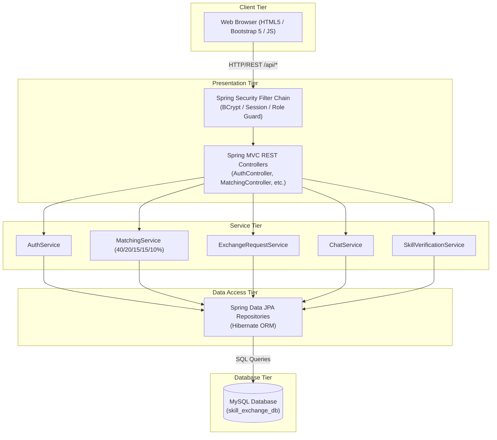
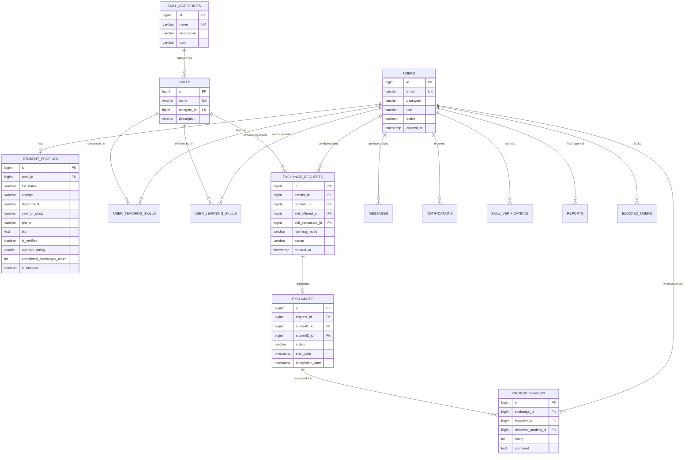
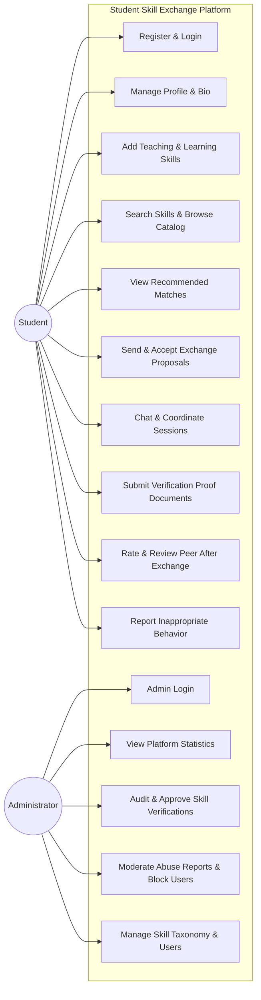
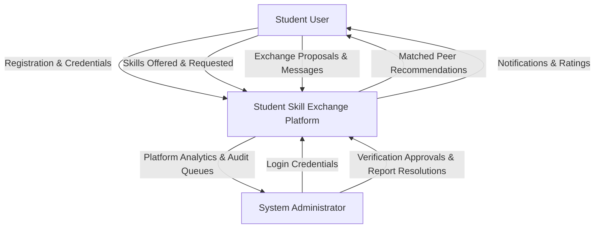
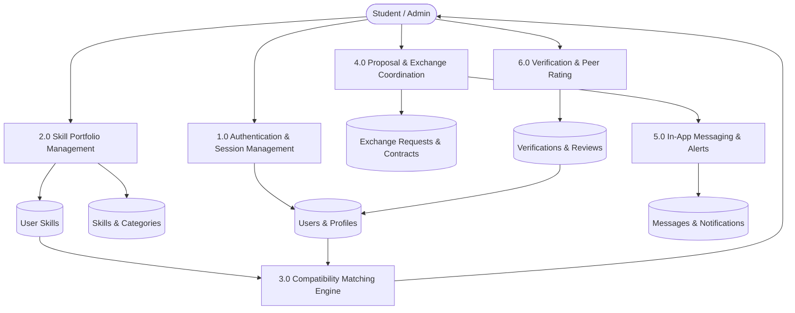
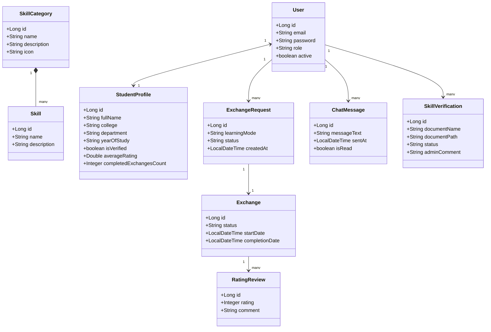

# STUDENT SKILL EXCHANGE PLATFORM
### 2nd-Year Information Technology Mini-Project Report & Documentation

---

## 1. ABSTRACT
In modern university environments, students possess diverse skills ranging from programming languages, software development frameworks, and UI/UX design to soft skills like public speaking, technical writing, and media editing. However, peer-to-peer knowledge transfer remains largely unorganized, informal, and limited to immediate social circles. Commercial tutoring portals and e-learning platforms impose prohibitive financial costs and often lack contextualized, flexible peer support. 

This project presents the **Student Skill Exchange Platform**, a decentralized web application tailored for college students to exchange academic, technical, and creative skills under a mutual barter mechanism without financial transaction. Built using **Java Spring Boot**, **Spring Data JPA/Hibernate**, **Spring Security with BCrypt encryption**, and a **MySQL** relational database, the system incorporates an explainable heuristic **Skill Matching Algorithm** based on a five-factor compatibility formula ($40\%$ direct skill compatibility, $20\%$ reverse mutual trade, $15\%$ peer rating, $15\%$ administrative verification, and $10\%$ academic synergy). The platform features student-to-student in-built chat, customizable learning modes (Online, Offline Campus, and Chat), an administrative skill verification audit queue, and post-exchange 5-star peer reviews. The resulting system optimizes campus resource utilization, fosters collaborative learning, and offers an intuitive, responsive user interface styled with Bootstrap 5 and modern aesthetic principles.

---

## 2. INTRODUCTION
Peer-assisted learning is recognized in cognitive psychology as one of the most effective pedagogical strategies. University students often learn more effectively when guided by peers who have recently overcome the same conceptual roadblocks. However, students who want to learn a specialized skill (e.g., Photoshop or Premiere Pro) may not know a peer who is proficient in that area and simultaneously willing to teach in exchange for a skill they possess (e.g., Java or Python).

The **Student Skill Exchange Platform** bridges this communication divide by providing an automated, fair, and secure ecosystem where students can list skills they can teach, declare skills they wish to acquire, and discover compatible barter partners.

---

## 3. PROBLEM STATEMENT
Traditional academic environments suffer from three core deficiencies in peer skill sharing:
1. **Lack of Discovery Mechanism:** Students have no centralized directory to search peers based on specific programming competencies, design expertise, or language fluency across departments and academic years.
2. **One-Way Transaction Burden:** Standard tutoring requires monetary payment, which creates financial friction for university students who already have valuable reciprocal knowledge to offer.
3. **Credibility & Misrepresentation Issues:** Informal campus exchanges frequently suffer from unverified competence claims, leading to wasted time and mismatched expectations.

---

## 4. OBJECTIVES
The principal objectives of this mini project are:
1. To develop a secure, web-based platform with role-based authentication (`ROLE_STUDENT` and `ROLE_ADMIN`) using Spring Security and BCrypt password encryption.
2. To design and implement a transparent, non-black-box **Skill Matching Algorithm** that calculates mutual compatibility between students' teaching and learning profiles.
3. To provide flexible **Learning Modes** allowing students to coordinate through Online video links, campus Offline meetings, or In-built Chat.
4. To establish a **Skill Verification Mechanism** where administrators review certificates or project portfolios to award verified skill badges.
5. To implement a closed-loop **Rating and Review System** preventing duplicate submissions and updating live student trust scores.
6. To implement real-time student messaging and in-app event notifications.

---

## 5. EXISTING SYSTEM VS. PROPOSED SYSTEM

### 5.1 Existing System
* **Methods:** WhatsApp/Telegram college groups, bulletin boards, commercial tutoring portals (Chegg, Superprof).
* **Limitations:**
  * High financial subscription costs.
  * Information is lost in chat noise.
  * No mutual barter or reciprocity algorithm.
  * No skill certification audit or student verification.
  * Lack of accountability and feedback mechanisms.

### 5.2 Proposed System
* **Features:**
  * Free, peer-to-peer reciprocal knowledge barter.
  * Explainable 5-factor matching algorithm ($40/20/15/15/10\%$).
  * Administrative document auditing with **✓ VERIFIED SKILL** badge display.
  * Post-exchange 1–5 star ratings preventing multiple submissions per trade.
  * Responsive, modern Bootstrap 5 UI themed in soft lavender, purple, and subtle pink accents.

---

## 6. LITERATURE REVIEW & RESEARCH GAP

### 6.1 Literature Review
Studies in cooperative learning (Johnson & Johnson, 2009) indicate that peer teaching reinforces foundational knowledge for the tutor while delivering personalized, low-anxiety instruction for the tutee. Digital barter platforms in economics illustrate that double coincidence of wants can be resolved through indexed multi-parameter matching systems (Roth, 2015).

### 6.2 Research Gap
While commercial freelance and tutoring portals exist, they are optimized for monetary transactions. Existing open campus platforms lack verification pipelines and structured barter contracts. The proposed system addresses this gap by combining automated heuristic matching, administrative verification, and flexible delivery modes within a single, lightweight architecture suitable for college deployment.

---

## 7. PROPOSED METHODOLOGY
The system was engineered using the **Agile Iterative Model**:
1. **Requirement Analysis:** Identifying student personas, peer barter rules, and administrative governance.
2. **Database & Entity Design:** Structuring relational schemas in third normal form (3NF) with foreign key constraints.
3. **Backend Service Layer:** Implementing business logic, matching heuristics, and Spring Security filters.
4. **REST API Development:** Creating standardized REST endpoints returning structured `ApiResponse<T>` envelopes.
5. **Frontend Assembly:** Building responsive HTML5/Bootstrap 5 views with asynchronous JavaScript `fetch()` calls.
6. **Testing & Validation:** Verification of edge cases, duplicate restrictions, and role authorizations.

---

## 8. SYSTEM ARCHITECTURE

---

## 9. EXPLAINABLE SKILL MATCHING ALGORITHM (MODULE 4)

The matching score between Student A (requester) and Student B (candidate) is determined using a deterministic weighted formula:

$$\text{Match Score} = S_{\text{direct}} + S_{\text{reverse}} + S_{\text{rating}} + S_{\text{verification}} + S_{\text{synergy}}$$

Where:
1. **Direct Skill Compatibility ($S_{\text{direct}} = 40\%$):**
   * If Student B teaches $\ge 1$ skill that Student A wants to learn: $+40$ points.
2. **Reverse Skill Compatibility ($S_{\text{reverse}} = 20\%$):**
   * If Student A teaches $\ge 1$ skill that Student B wants to learn (two-way mutual exchange): $+20$ points.
3. **Peer Rating Score ($S_{\text{rating}} = 15\%$):**
   * Calculated as: $\left(\frac{\text{Candidate Rating}}{5.0}\right) \times 15$. (New students default to $3.5 \to 10.5$ pts).
4. **Administrative Verification ($S_{\text{verification}} = 15\%$):**
   * If Student B holds an approved verified skill badge: $+15$ points ($+6$ points for standard unverified).
5. **Academic / Campus Synergy ($S_{\text{synergy}} = 10\%$):**
   * Same Department & College: $+10$ points.
   * Same College: $+7$ points. Cross-Campus: $+4$ points.

---

## 10. ENTITY-RELATIONSHIP (ER) DIAGRAM

---

## 11. USE CASE DIAGRAM

---

## 12. DATA FLOW DIAGRAMS

### 12.1 DFD Level 0 (Context Diagram)

### 12.2 DFD Level 1

---

## 13. CLASS DIAGRAM

---

## 14. HARDWARE & SOFTWARE REQUIREMENTS

### 14.1 Hardware Requirements
* **Processor:** Intel Core i3 / AMD Ryzen 3 or higher
* **RAM:** Minimum 4 GB (8 GB recommended for IDE + Spring Boot + MySQL)
* **Storage:** 500 MB free hard disk space
* **Network:** Standard Local Area Network or Localhost

### 14.2 Software Requirements
* **Operating System:** Windows 10/11, macOS, or Linux
* **Java Development Kit (JDK):** OpenJDK / Oracle JDK 17 (LTS)
* **Database:** MySQL Server 8.0+ (or H2 In-Memory for testing)
* **Build Tool:** Apache Maven 3.8+
* **Web Browser:** Google Chrome, Mozilla Firefox, or Microsoft Edge
* **Development Environment:** IntelliJ IDEA, VS Code, or Eclipse

---

## 15. TESTING & TEST CASES

| Test ID | Test Scenario | Input Data | Expected Result | Status |
| :--- | :--- | :--- | :--- | :--- |
| **TC-01** | Student Registration | Valid academic details, matching password | User and profile saved, session created | **PASS** |
| **TC-02** | Password Confirmation Mismatch | Password: `secret1`, Confirm: `secret2` | 400 Bad Request: "Passwords do not match" | **PASS** |
| **TC-03** | Duplicate Email Check | Existing email: `harsh@college.edu` | 409 Conflict: "Email already exists" | **PASS** |
| **TC-04** | BCrypt Encryption Verification | Plaintext password in DB inspection | Non-reversible hash prefixed `$2a$10$...` | **PASS** |
| **TC-05** | Direct Skill Matching | Harsh wants Photoshop, Sejal teaches it | Direct match detected, +40 points awarded | **PASS** |
| **TC-06** | Mutual Barter Compatibility | Sejal wants Java, Harsh teaches it | Mutual trade identified, +20 points awarded | **PASS** |
| **TC-07** | Duplicate Skill Prevention | Adding 'Java' twice to teaching list | 409 Conflict: "Skill already added" | **PASS** |
| **TC-08** | Self-Exchange Prevention | Request senderId == receiverId | 400 Bad Request: "Cannot request self" | **PASS** |
| **TC-09** | Admin Verification Flow | Admin clicks 'Approve' on proof | Status=VERIFIED, Verified badge awarded | **PASS** |
| **TC-10** | Duplicate Review Prevention | Submitting 2nd review for same exchange | 409 Conflict: "Already reviewed exchange" | **PASS** |
| **TC-11** | Rating Recalculation | 5★ review submitted | Student average rating updated immediately | **PASS** |

---

## 16. FUTURE SCOPE
1. **Video Conferencing Integration:** WebRTC peer-to-peer integrated audio/video directly within the browser.
2. **Automated Skill Quiz Assessments:** Objective MCQ quizzes to auto-verify beginner skills prior to admin audit.
3. **Calendar Integration:** Google Calendar / iCal synchronization for scheduled study sessions.
4. **Mobile Application:** Native Flutter / React Native client for Android and iOS devices.

---

## 17. CONCLUSION
The **Student Skill Exchange Platform** successfully demonstrates how modern web architectures can revitalize campus peer learning. By eliminating monetary barriers, integrating an explainable matching algorithm, and enforcing quality through administrative skill audits and peer feedback loops, the platform empowers college students to teach what they know and master what they desire.
